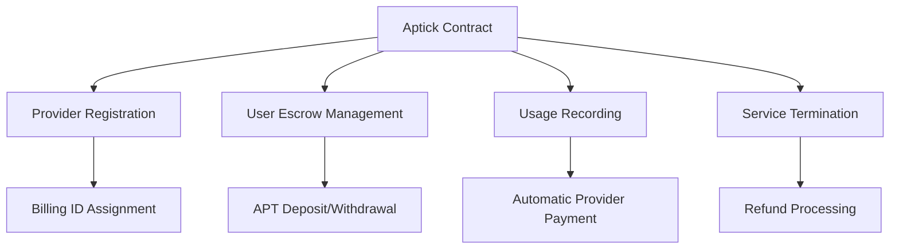

# 🔥 Aptick - Decentralized Billing System

[](https://github.com/virtualconnekt/aptick)
[](https://opensource.org/licenses/MIT)
[](https://aptos.dev)
[](https://move-language.github.io/move/)
[](https://nextjs.org/)
[](https://www.typescriptlang.org/)

> A revolutionary decentralized billing and payment system built on the Aptos blockchain, enabling seamless usage-based billing for Web3 services.

## 🌟 Overview

Aptick transforms how services are billed and paid for in the Web3 ecosystem. By leveraging the power of the Aptos blockchain and Move smart contracts, Aptick provides a trustless, transparent, and efficient billing system where:

- **Providers** can register their services and set pricing models
- **Users** can prepay for services with APT tokens
- **Usage** is tracked on-chain with automatic payments
- **Refunds** are handled automatically when services are terminated

Perfect for cloud services, APIs, SaaS platforms, data storage, bandwidth, computational resources, and any usage-based business model.

## ✨ Key Features

### 🏗️ **Smart Contract Core**
- **Trustless Billing**: All transactions and billing logic handled by smart contracts
- **Escrow System**: User funds are held in secure escrow until services are consumed
- **Automatic Payments**: Providers get paid automatically as usage is recorded
- **Transparent Pricing**: All pricing and usage data is publicly verifiable on-chain

### 💼 **For Service Providers**
- Register services with custom pricing models
- Set price per unit (APT per GB, hour, request, etc.)
- Automatic revenue collection as usage occurs
- Real-time revenue tracking and analytics

### 👥 **For Service Users**
- Prepay for services with APT tokens
- Real-time balance and usage monitoring
- Automatic refunds for unused prepaid amounts
- Transparent billing with on-chain verification

### 🔧 **Developer Experience**
- Comprehensive TypeScript SDK
- React hooks for easy frontend integration
- Multi-wallet support (Petra, Martian, etc.)
- Complete documentation and examples

## 🚀 Quick Start

### Prerequisites

- [Node.js](https://nodejs.org/) (v18 or higher)
- [Aptos CLI](https://aptos.dev/tools/aptos-cli/install-cli)
- An Aptos wallet (Petra, Martian, etc.)

### 1. Clone the Repository

```bash
git clone https://github.com/username/aptick.git
cd aptick
npm install
```

### 2. Deploy Smart Contract

```bash
cd smartcontract
aptos init --network devnet
aptos move publish --named-addresses aptick_addr=default
```

### 3. Run Frontend Application

```bash
cd ../frontend
npm install
npm run dev
```

Visit `http://localhost:3000` to start using Aptick!

## 📁 Project Structure

```
aptick/
├── 📱 frontend/                 # Next.js React application
│   ├── src/
│   │   ├── app/                # App router pages
│   │   ├── components/         # React components
│   │   ├── lib/               # Utilities and services
│   │   └── types/             # TypeScript definitions
│   └── package.json
├── 🔗 smartcontract/          # Move smart contracts
│   ├── sources/
│   │   └── aptick.move        # Main billing contract
│   ├── tests/                 # Move unit tests
│   └── Move.toml
├── 📦 sdk/                    # TypeScript SDK (planned)
│   ├── src/
│   │   ├── client.ts          # Main SDK client
│   │   ├── types.ts           # Type definitions
│   │   ├── utils.ts           # Utility functions
│   │   └── react.ts           # React hooks
│   └── package.json
└── README.md
```

## 🔧 Architecture

### Smart Contract Architecture



### Core Components

#### 🏢 **Provider**
```move
struct Provider has store, drop {
    provider_addr: address,     // Provider's wallet address
    price_per_unit: u64,       // Price in octas per unit
    unit: String,              // Unit type (GB, hours, etc.)
    billing_id: u64,           // Unique service identifier
    active: bool,              // Service status
    total_revenue: u64,        // Lifetime earnings
}
```

#### 💰 **UserEscrow**
```move
struct UserEscrow has store, key {
    coins: coin::Coin<AptosCoin>,  // Prepaid APT balance
    usage_units: u64,              // Total units consumed
}
```

#### 🌐 **Global State**
```move
struct Aptick has key {
    next_billing_id: u64,                           // Auto-incrementing ID
    providers: Table<u64, Provider>,                // All registered providers
    balances: Table<BalanceKey, UserEscrow>,        // User escrow accounts
}
```

## 💡 Usage Examples

### Register as a Service Provider

```typescript
import { AptickClient } from '@aptick/sdk';
import { useWallet } from '@aptos-labs/wallet-adapter-react';

const { signAndSubmitTransaction } = useWallet();
const client = new AptickClient({ network: 'devnet' });

// Register cloud storage service at 0.001 APT per GB
const result = await client.registerProvider(
  signAndSubmitTransaction,
  0.001,  // Price per unit in APT
  'GB'    // Unit type
);

console.log(`Registered! Billing ID: ${result.data}`);
```

### User Prepays for Service

```typescript
// User deposits 5 APT for cloud storage
await client.deposit(
  signAndSubmitTransaction,
  billingId,  // Provider's billing ID
  5.0         // 5 APT deposit
);
```

### Provider Records Usage

```typescript
// Provider records that user consumed 10 GB
await client.recordUsage(
  signAndSubmitTransaction,
  billingId,     // Service billing ID
  userAddress,   // Customer's address
  10             // 10 GB used
);
// User is automatically charged 0.01 APT (10 GB × 0.001 APT/GB)
// Provider receives payment immediately
```

### User Terminates Service

```typescript
// User terminates service and gets refund of unused balance
await client.terminateService(
  signAndSubmitTransaction,
  billingId
);
// Remaining escrow balance automatically refunded to user
```

## 🏃‍♂️ Running the Application

### Development Mode

```bash
# Start smart contract development
cd smartcontract
aptos move test              # Run contract tests
aptos move compile           # Compile contracts

# Start frontend development
cd frontend
npm run dev                  # Start development server
npm run lint                 # Check code quality
npm run build                # Production build
```

### Testing

```bash
# Smart contract tests
cd smartcontract
aptos move test

# Frontend tests (when implemented)
cd frontend
npm test
```

## 🌐 Network Configuration

### Supported Networks

| Network | Status | Contract Address | RPC URL |
|---------|--------|------------------|---------|
| **Devnet** | ✅ Live | `0x72780903f4ca64d29bf9fcd1be4b863190d76d25cc5efd176ee4b119732419c1` | https://fullnode.devnet.aptoslabs.com |
| **Testnet** | 🚧 Planned | TBD | https://fullnode.testnet.aptoslabs.com |
| **Mainnet** | 🚧 Planned | TBD | https://fullnode.mainnet.aptoslabs.com |

### Environment Configuration

Create a `.env.local` file in the frontend directory:

```env
NEXT_PUBLIC_NETWORK=devnet
NEXT_PUBLIC_CONTRACT_ADDRESS=0x72780903f4ca64d29bf9fcd1be4b863190d76d25cc5efd176ee4b119732419c1
NEXT_PUBLIC_MODULE_NAME=billing
```

## 📚 API Reference

### Smart Contract Functions

#### Entry Functions (Transactions)

```move
// Initialize the billing system (one-time setup)
public entry fun init(admin: &signer)

// Register as a service provider
public entry fun register_provider(
    provider: &signer,
    price_per_unit: u64,  // Price in octas
    unit: String          // Unit type (e.g., "GB", "hours")
)

// Deposit APT into escrow for a service
public entry fun deposit(
    user: &signer,
    billing_id: u64,      // Provider's billing ID
    amount: u64           // Amount in octas
)

// Record usage and charge user (provider only)
public entry fun record_usage(
    provider: &signer,
    billing_id: u64,      // Service billing ID
    user_addr: address,   // Customer address
    units: u64            // Units consumed
)

// Terminate service and refund user
public entry fun terminate_service(
    user: &signer,
    billing_id: u64       // Service billing ID
)
```

#### View Functions (Queries)

```move
// Get provider's price per unit
public fun provider_price_per_unit(billing_id: u64): u64

// Get provider's address
public fun provider_addr(billing_id: u64): address

// Get user's escrow balance
public fun user_balance(billing_id: u64, user: address): u64

// Get user's total usage units
public fun user_usage_units(billing_id: u64, user: address): u64
```

### SDK Methods

```typescript
// Initialize SDK client
const client = new AptickClient({ network: 'devnet' });
await client.initialize();

// Provider operations
await client.registerProvider(walletSignFn, pricePerUnit, unit);
await client.recordUsage(walletSignFn, billingId, userAddress, units);

// User operations
await client.deposit(walletSignFn, billingId, aptAmount);
await client.terminateService(walletSignFn, billingId);

// Query operations
await client.getProvider(billingId);
await client.getUserEscrow(billingId, userAddress);
await client.getAptBalance(address);
```

## 🔒 Security Features

### Smart Contract Security

- **Access Control**: Only providers can record usage for their services
- **Overflow Protection**: Safe arithmetic operations using Move's built-in protections
- **Resource Safety**: Move's resource system prevents double-spending and ensures asset safety
- **Escrow Security**: User funds are held in secure on-chain escrow accounts

### Frontend Security

- **Wallet Integration**: Uses official Aptos wallet adapters for secure transaction signing
- **Input Validation**: Client-side and contract-level validation of all inputs
- **Error Handling**: Comprehensive error handling with user-friendly messages

## 🗺️ Roadmap

### Phase 1: Core Billing System ✅
- [x] Move smart contract development
- [x] Basic frontend interface
- [x] Provider registration
- [x] User deposit and termination
- [x] Usage recording and billing

### Phase 2: Enhanced Features 🚧
- [ ] TypeScript SDK development
- [ ] React hooks and components
- [ ] Advanced analytics dashboard
- [ ] Multi-token support (beyond APT)
- [ ] Subscription-based billing models

### Phase 3: Enterprise Features 🔮
- [ ] API rate limiting integration
- [ ] Webhook notifications
- [ ] Advanced reporting and analytics
- [ ] Multi-signature provider accounts
- [ ] Governance token for protocol upgrades

### Phase 4: Ecosystem Growth 🌱
- [ ] Mainnet deployment
- [ ] Partnership integrations
- [ ] Developer grants program
- [ ] Third-party service marketplace

## 🤝 Contributing

We welcome contributions from the community! Here's how you can help:

### Development Setup

1. **Fork the repository**
2. **Create a feature branch**: `git checkout -b feature/amazing-feature`
3. **Make your changes** with proper tests
4. **Commit your changes**: `git commit -m 'Add amazing feature'`
5. **Push to the branch**: `git push origin feature/amazing-feature`
6. **Open a Pull Request**

### Contribution Areas

- 🔧 **Smart Contract**: Enhance billing logic, add new features
- 🎨 **Frontend**: Improve UI/UX, add new pages and components
- 📚 **Documentation**: Improve docs, add tutorials and examples
- 🧪 **Testing**: Add test coverage, improve test scenarios
- 🔍 **Security**: Security audits, vulnerability reporting

### Code Style

- Follow existing code conventions
- Add comprehensive tests for new features
- Update documentation for any changes
- Use meaningful commit messages

## 📄 License

This project is licensed under the MIT License - see the [LICENSE](LICENSE) file for details.

## 🙏 Acknowledgments

- **Aptos Labs** for the incredible blockchain platform
- **Move Language** for secure smart contract development
- **Next.js** for the amazing React framework
- **Tailwind CSS** for beautiful styling

## 📞 Support & Community

- **Documentation**: [docs.aptick.dev](https://docs.aptick.dev) (coming soon)
- **Discord**: [Join our community](https://discord.gg/aptick) (coming soon)
- **Twitter**: [@AptickBilling](https://twitter.com/Ap_tick)
- **Issues**: [GitHub Issues](https://github.com/virtualconnekt/aptick/issues)

## 📊 Stats


---

<div align="center">

**Built with ❤️ for the Aptos ecosystem**

[Website](https://aptick.dev) • [Documentation](https://docs.aptick.dev) • [Discord](https://discord.gg/aptick) • [Twitter](https://twitter.com/Ap_tick)

</div>
